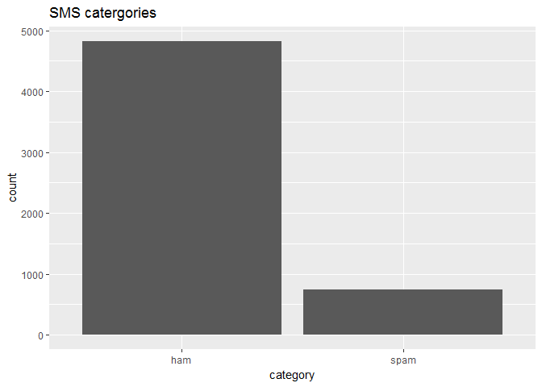
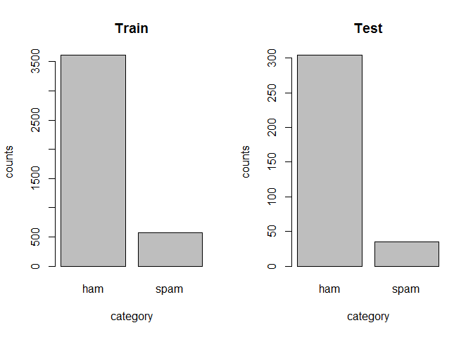
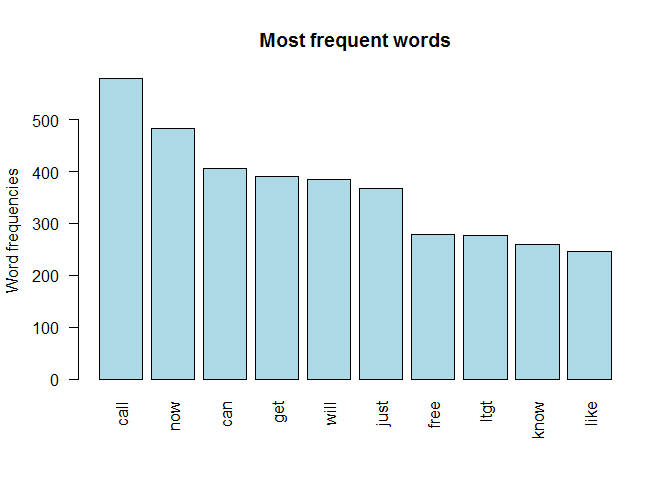
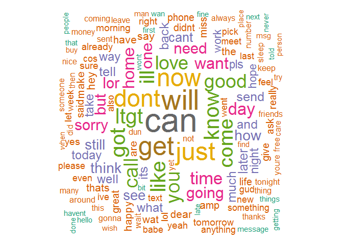
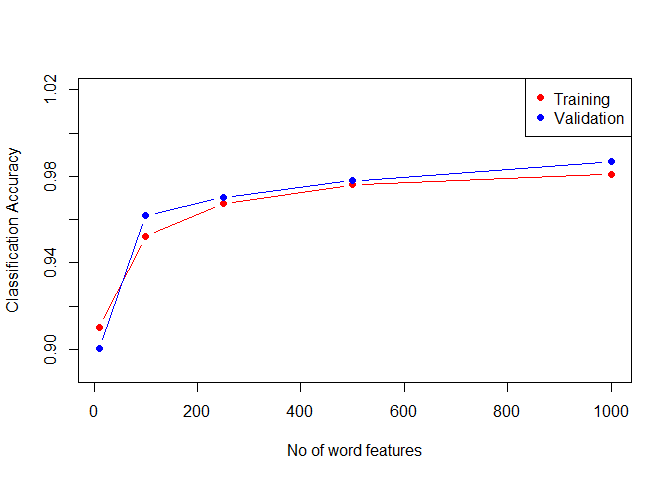

Untitled
================
subhash
4 May 2018

### Business Objective

Many email services today provide spam filters that are able to classify emails into spam and non-spam email with high accuracy. This project aims to build a spam classifier for sms recieved by the mobile phose users.
We will building the application from scratch and will follow the traditional Data science workflow.

-   Data Collection
-   Understanding Data
-   Data Cleaning
-   Data preparation
-   Analyze Data
-   Modelling
-   Testing

Loading the required libraries.

``` r
library(caret)
library(readr)
library(ggplot2)
library(gridExtra)
library(tm)
library(knitr)
```

#### Data Collection

Kaggle is home of datascience learner. It host compitetion and has many free to use datasets, which can be used for practicing your ML skills. For the project, we obtained a structured data of SMS messages in CSV format which has 2 variables- category and message.

``` r
smsdata <- read.csv("SPAM text message 20170820 - Data.csv", stringsAsFactors = FALSE)
kable(head(smsdata),caption = "SMS spam dataset")
```

| Category        | Message                                                                                                                                                                                                      |
|:----------------|:-------------------------------------------------------------------------------------------------------------------------------------------------------------------------------------------------------------|
| ham             | Go until jurong point, crazy.. Available only in bugis n great world la e buffet... Cine there got amore wat...                                                                                              |
| ham             | Ok lar... Joking wif u oni...                                                                                                                                                                                |
| spam            | Free entry in 2 a wkly comp to win FA Cup final tkts 21st May 2005. Text FA to 87121 to receive entry question(std txt rate)T&C's apply 08452810075over18's                                                  |
| ham             | U dun say so early hor... U c already then say...                                                                                                                                                            |
| ham             | Nah I don't think he goes to usf, he lives around here though                                                                                                                                                |
| spam            | FreeMsg Hey there darling it's been 3 week's now and no word back! I'd like some fun you up for it still? Tb ok! XxX std chgs to send, £1.50 to rcv                                                         |
| \#\#\#\# Unders | tanding the data                                                                                                                                                                                             |
| The categor     | y variable is of character class which has to be converted to factor variable. There are about 5572 observations/messages.The category type is skewed towards the "ham" class, spam messages are around 750. |

``` r
str(smsdata)
```

    ## 'data.frame':    5572 obs. of  2 variables:
    ##  $ Category: chr  "ham" "ham" "spam" "ham" ...
    ##  $ Message : chr  "Go until jurong point, crazy.. Available only in bugis n great world la e buffet... Cine there got amore wat..." "Ok lar... Joking wif u oni..." "Free entry in 2 a wkly comp to win FA Cup final tkts 21st May 2005. Text FA to 87121 to receive entry question("| __truncated__ "U dun say so early hor... U c already then say..." ...

``` r
smsdata$Category<-as.factor(smsdata$Category)
table(smsdata$Category)
```

    ## 
    ##  ham spam 
    ## 4825  747

``` r
ggplot(smsdata)+geom_bar(aes(smsdata$Category))+xlab("category")+ggtitle("SMS catergories")
```



We create a corpus using the messages we have and Lets examine it.The Corpus() function creates an R object to store text documents. Since we have already read the SMS messages and stored them in an R vector, we specify VectorSource(), which tells Corpus() to use the messages in the vector smsdata$Message.

``` r
message_corpus <- Corpus(VectorSource(smsdata$Message))
inspect(message_corpus[1:3])
```

    ## <<SimpleCorpus>>
    ## Metadata:  corpus specific: 1, document level (indexed): 0
    ## Content:  documents: 3
    ## 
    ## [1] Go until jurong point, crazy.. Available only in bugis n great world la e buffet... Cine there got amore wat...                                            
    ## [2] Ok lar... Joking wif u oni...                                                                                                                              
    ## [3] Free entry in 2 a wkly comp to win FA Cup final tkts 21st May 2005. Text FA to 87121 to receive entry question(std txt rate)T&C's apply 08452810075over18's

We see that the messages are similar to the ones we recieve. Above examples show that message may contains a URL, numbers, and dollaramounts. To process these sms we need to clean it before doing any analysis.

#### Data Cleaning

Preprocessing and cleaning our text data can improve our performance of spam classifier. So we will use some basic preprocessing step such as-

-   Lower-casing: The entire sms is converted into lower case, so that captialization is ignored
-   Numbers: All the numbers are removed.
-   Stopwords: stop words are removed using the R Builtin stopwords.
-   Removal of non-words: Non-words and punctuation have been removed.
-   Trimming: All white spaces (tabs, newlines, spaces) have all been trimmed to a single space character.

``` r
corpus_clean <- tm_map(message_corpus,tolower)
inspect(corpus_clean[1:5])
```

    ## <<SimpleCorpus>>
    ## Metadata:  corpus specific: 1, document level (indexed): 0
    ## Content:  documents: 5
    ## 
    ## [1] go until jurong point, crazy.. available only in bugis n great world la e buffet... cine there got amore wat...                                            
    ## [2] ok lar... joking wif u oni...                                                                                                                              
    ## [3] free entry in 2 a wkly comp to win fa cup final tkts 21st may 2005. text fa to 87121 to receive entry question(std txt rate)t&c's apply 08452810075over18's
    ## [4] u dun say so early hor... u c already then say...                                                                                                          
    ## [5] nah i don't think he goes to usf, he lives around here though

``` r
corpus_clean <- tm_map(corpus_clean, removeNumbers)
inspect(corpus_clean[1:5])
```

    ## <<SimpleCorpus>>
    ## Metadata:  corpus specific: 1, document level (indexed): 0
    ## Content:  documents: 5
    ## 
    ## [1] go until jurong point, crazy.. available only in bugis n great world la e buffet... cine there got amore wat...                   
    ## [2] ok lar... joking wif u oni...                                                                                                     
    ## [3] free entry in  a wkly comp to win fa cup final tkts st may . text fa to  to receive entry question(std txt rate)t&c's apply over's
    ## [4] u dun say so early hor... u c already then say...                                                                                 
    ## [5] nah i don't think he goes to usf, he lives around here though

``` r
# Removing Stop Words
corpus_clean <- tm_map(corpus_clean, removeWords, stopwords())
inspect(corpus_clean[1:3])
```

    ## <<SimpleCorpus>>
    ## Metadata:  corpus specific: 1, document level (indexed): 0
    ## Content:  documents: 3
    ## 
    ## [1] go  jurong point, crazy.. available   bugis n great world la e buffet... cine  got amore wat...                      
    ## [2] ok lar... joking wif u oni...                                                                                        
    ## [3] free entry    wkly comp  win fa cup final tkts st may . text fa    receive entry question(std txt rate)t&c's apply 's

``` r
# Removing punctuation:
corpus_clean <- tm_map(corpus_clean, removePunctuation)
inspect(corpus_clean[1:3])
```

    ## <<SimpleCorpus>>
    ## Metadata:  corpus specific: 1, document level (indexed): 0
    ## Content:  documents: 3
    ## 
    ## [1] go  jurong point crazy available   bugis n great world la e buffet cine  got amore wat                         
    ## [2] ok lar joking wif u oni                                                                                        
    ## [3] free entry    wkly comp  win fa cup final tkts st may  text fa    receive entry questionstd txt ratetcs apply s

``` r
# Strip White Spaces
corpus_clean <- tm_map(corpus_clean, stripWhitespace)
inspect(corpus_clean[1:3])
```

    ## <<SimpleCorpus>>
    ## Metadata:  corpus specific: 1, document level (indexed): 0
    ## Content:  documents: 3
    ## 
    ## [1] go jurong point crazy available bugis n great world la e buffet cine got amore wat                     
    ## [2] ok lar joking wif u oni                                                                                
    ## [3] free entry wkly comp win fa cup final tkts st may text fa receive entry questionstd txt ratetcs apply s

#### Data Preparation

As usual for any data science problem, to evalute the performance of our ML model we will split the data into training set and test set (used for evaluation).Important to check the class distbribution for both trainset and testset, so that they are evenly split.

``` r
set.seed(99)
# We use the dataset to create a partition (75% training 25% testing)
index <- sample(1:nrow(smsdata), 0.75*nrow(smsdata))
# select 25% of the data for testing
testset <- smsdata[-index,]
# select 75% of data to train the models
trainset <- smsdata[index,]
par(mfrow=c(1,2))
plot(trainset$Category,xlab="category",ylab="counts",main = "Train")
plot(testset$Category[-index],xlab="category",ylab="counts",main = "Test")
```



#### Analyze the Data

We can find the most frequent words that are seen in the messages using the term-document matrix which is a mathematical matrix that describes the frequency of terms that occur in a collection of documents. In a document-term matrix, rows correspond to documents in the collection and columns correspond to terms/word.

``` r
dtm <- TermDocumentMatrix(corpus_clean)
m <- as.matrix(dtm)
v <- sort(rowSums(m),decreasing=TRUE)
d <- data.frame(word = names(v),freq=v)
barplot(d[1:10,]$freq, las = 2, names.arg = d[1:10,]$word,
        col ="lightblue", main ="Most frequent words",
        ylab = "Word frequencies")
```



We see the top 10 words in the whole message dataset irrespective of the sms.We can use a word cloud which is a way to visually depict the frequency at which words appear in text data. The cloud is made up of words scattered somewhat randomly around the figure Words appearing more often in the text are shown in a larger font, while less common terms are shown in smaller fonts. category.

``` r
library(RColorBrewer)
library(wordcloud)
#wordcloud for spam messages
wordcloud(trainset$Message[trainset$Category=="spam"], min.freq = 5,
          max.words=200, random.order=FALSE, rot.per=0.35, 
          colors=brewer.pal(8, "Dark2"))
```


``` r
#wordcloud for good messages
wordcloud(trainset$Message[trainset$Category=="ham"], min.freq = 35,
          max.words=200, random.order=FALSE, rot.per=0.35, 
          colors=brewer.pal(8, "Dark2"))
```



We see that the words "call","now,"free" are more frequent in the spam sms which is normally expected. \#\#\#\# Modelling

The heart of our application lies the Machine learning model.We will be using a Naive Bayes which is a good algorithm for working with text classification. When dealing with text, it's very common to treat each unique word as a feature as we are doing using term document matrix.Naive Bayes performs well when we have multiple classes and working with text classification.

Advantage of Naive Bayes algorithms are:
\* It is simple and if the conditional independence assumption actually holds, a Naive Bayes classifier will converge quicker than discriminative models like logistic regression, so you need less training data. And even if the NB assumption doesn't hold.
\* It requires less model training time

Currently we have document term matrix of our entire corpus which is just a matrix of 1's and 0's which represented whether the word is present in the document/message or not.As our feature are terms/words the matrix containing the data must be treated factor varibles by our NB model.

``` r
#converting variable into factorclass
convert_factor <- function(x) {
  x <- factor(ifelse(x > 0, 1, 0))
    return(x)
}
```

From the "d" dataframe we know there are 7596 terms/words. We could use all these terms as features in our model but it isnt viable. So lets rescrict ourselves by using the top frequent words, this is a clever way of reducing the features to train our model. In order to choose the optimal number of frequent words("n") to be used as features, we use a validation set split from the training set, to measure the classification accuracy for different values of "n" and choose the minimum "n" which gives a good performance.

``` r
library(e1071)
set.seed(99)
index_validation<-sample(1:nrow(trainset), 0.75*nrow(trainset))
train_corpus<-corpus_clean[index]
```

"train\_corpus" is corpus of documents from the training set, which is further indexed for training and validation. Below is a function which returns the vector of training accuracy and validation accuracy.The methodoly for building the NB classifier is fairly simple, one can use the "e1071" package.

Here are the steps involved in building the model:

-   Create a vector of frequent words which are to used as features
-   Create document term matrix for both training set and validation set.
-   Convert the DTM into matrix with factor variables
-   Build the Naive bayes model.
-   Make predictions and calcuate the accuracy

``` r
naiveclass<-function(n)
{
frequentWords<-as.character(d$word[1:n])
# Creating a Document Term Matrix using words that have high frequency
sms_train<- DocumentTermMatrix(train_corpus[index_validation], list(dictionary = frequentWords))
sms_test <- DocumentTermMatrix(train_corpus[-index_validation], list(dictionary = frequentWords))
#convert the DM into matrix for passing into the model
sms_train <- apply(sms_train, MARGIN = 2, convert_factor)
sms_test <- apply(sms_test, MARGIN = 2, convert_factor)
#build the model
sms_classifier <- naiveBayes(sms_train, trainset[index_validation,]$Category)
#make predictions
sms_test_pred <- predict(sms_classifier, sms_test)
sms_train_pred <- predict(sms_classifier, sms_train)
return (cbind(mean(trainset[-index_validation,]$Category==sms_test_pred),mean(trainset[index_validation,]$Category==sms_train_pred)))
}
```

We can test the model for different values of "n" and choose the minimum based on the validation accuracy.

``` r
acc=matrix(NA,5,2)
n=c(10,100,250,500,1000)
for(i in 1:5){
  #print(i)
  acc[i,]=naiveclass(n[i])
}
plot(n,acc[,1],pch=19,type="b",col="red",ylab = "Classification Accuracy",ylim  =c(0.89,1.02),xlab="No of word features")
points(n,acc[,2],col="blue",pch=19,type="b",ylim=c(0.89,1.0))
legend("topright",legend=c("Training","Validation"),col=c("red","blue"),pch=19)
```



We see that the validation accuracy closely follows the training accuracy and the curves flatten out as you increase the number of terms included. We reach a maximum of 98% with just 1000 features out of possible 7956. We see an good improvement by incresing the features from 10 to 100. So our optimal "n" would be choosing n=500. We can now draw predictions using our model on the seperated test dataset and draw conclusions.

#### Testing

We will use n=500 and entire training set to build the model and make predictions on testset.

``` r
frequentWords<-as.character(d$word[1:500])
# Creating a Document Term Matrix using words that have high frequency
sms_train<- DocumentTermMatrix(corpus_clean[index], list(dictionary = frequentWords))
sms_test <- DocumentTermMatrix(corpus_clean[-index], list(dictionary = frequentWords))
#convert the DM into matrix for passing into the model
sms_train <- apply(sms_train, MARGIN = 2, convert_factor)
sms_test <- apply(sms_test, MARGIN = 2, convert_factor)
#build the model
sms_classifier <- naiveBayes(sms_train, trainset$Category)
#make predictions
sms_test_pred <- predict(sms_classifier, sms_test)
sms_train_pred <- predict(sms_classifier, sms_train)
confusionMatrix(sms_test_pred,testset$Category)
```

    ## Confusion Matrix and Statistics
    ## 
    ##           Reference
    ## Prediction  ham spam
    ##       ham  1209   29
    ##       spam    7  148
    ##                                           
    ##                Accuracy : 0.9742          
    ##                  95% CI : (0.9644, 0.9818)
    ##     No Information Rate : 0.8729          
    ##     P-Value [Acc > NIR] : < 2.2e-16       
    ##                                           
    ##                   Kappa : 0.877           
    ##  Mcnemar's Test P-Value : 0.0004653       
    ##                                           
    ##             Sensitivity : 0.9942          
    ##             Specificity : 0.8362          
    ##          Pos Pred Value : 0.9766          
    ##          Neg Pred Value : 0.9548          
    ##              Prevalence : 0.8729          
    ##          Detection Rate : 0.8679          
    ##    Detection Prevalence : 0.8887          
    ##       Balanced Accuracy : 0.9152          
    ##                                           
    ##        'Positive' Class : ham             
    ## 

We see an classification accuracy of 97.42%, which I consider very good. There are a total of 36 misclassified messages of which only 7 are legimate messages which are misclassified as spam messages( False Positives) Naive Bayes model is easy to build and particularly useful for very large data sets. It uses Bayes theorem which provides a way of calculating posterior probability P(c|x) from P(c), P(x) and P(x|c). We can access these prior probabilities from the NM model.

``` r
sms_classifier$tables[1:5]
```

    ## $going
    ##                  going
    ## trainset$Category           0           1
    ##              ham  0.967026877 0.032973123
    ##              spam 0.996491228 0.003508772
    ## 
    ## $got
    ##                  got
    ## trainset$Category          0          1
    ##              ham  0.95483513 0.04516487
    ##              spam 0.99122807 0.00877193
    ## 
    ## $told
    ##                  told
    ## trainset$Category          0          1
    ##              ham  0.98974785 0.01025215
    ##              spam 1.00000000 0.00000000
    ## 
    ## $message
    ##                  message
    ## trainset$Category          0          1
    ##              ham  0.98780826 0.01219174
    ##              spam 0.95614035 0.04385965
    ## 
    ## $send
    ##                  send
    ## trainset$Category          0          1
    ##              ham  0.97561651 0.02438349
    ##              spam 0.91403509 0.08596491

#### Further Work

Our ML model is ready to be deployed. Further improvements can be done by using Word Stemming: Words are reduced to their stemmed form. For example, "discount", "discounts", "discounted" and "discounting" are all replaced with "discount". This can essentially reduce features for the document term matrix. Other classifier can be tested out for comparing purposes.
